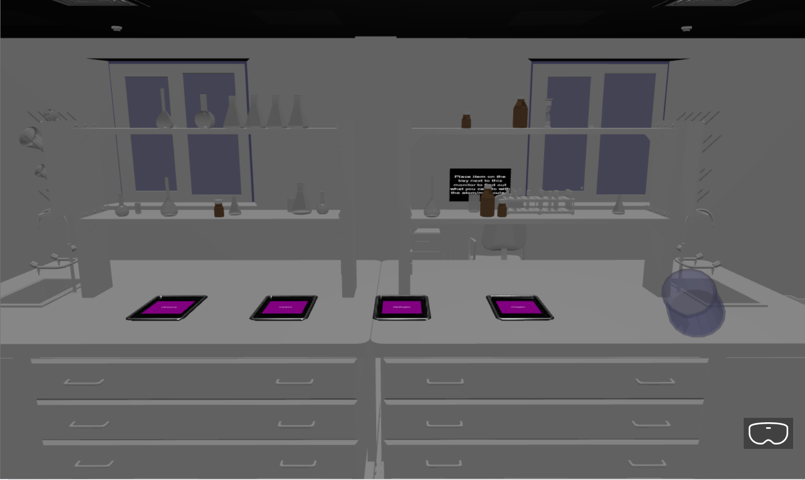
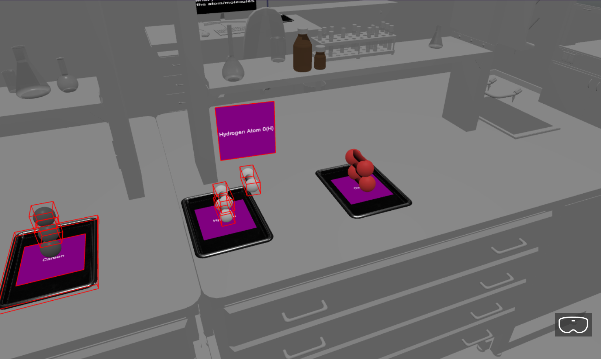
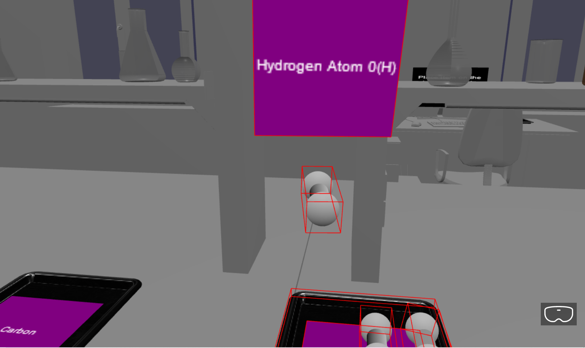
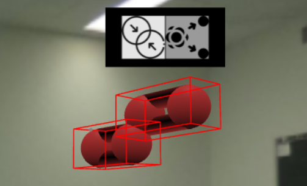
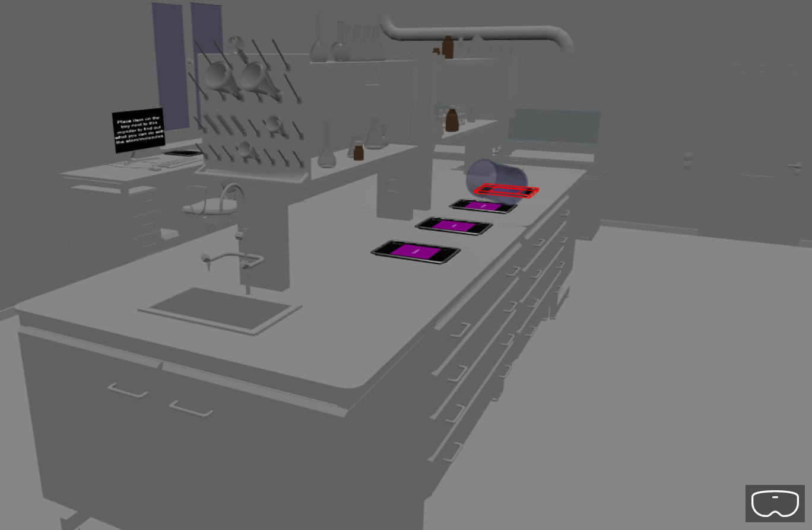
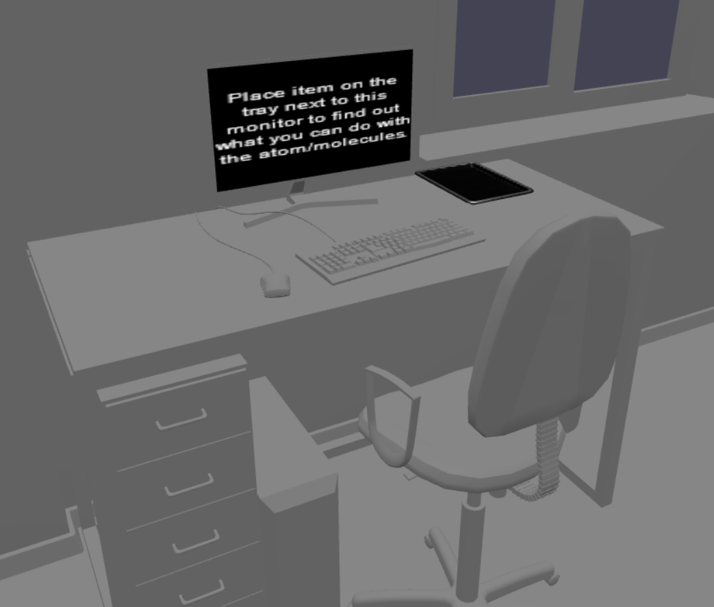

# CSD3120-Team Project
 
## Author
Yap Ming Han 2000490

Teck Wee Mohammad Hanif Koh 2001577

Tan Kai Xin 2002495

Loh Yun Xuan 2001533

Lee Yu Ting 2002892

## Brief
This is a team project done for CSD3120, which aims at providing an immersive experiences in a chemistry classroom setting via a WebXR Application.

The WebXR application runs on both PC and Virtual HMD Devices such as Oculus Quest.

Detailed information of the features that this application provides can be found below.

## Setup
Install Dependencies:
```
npm install
```

OR

```
npm install --save babylonjs
npm install --save babylonjs-gui
npm install --save babylonjs-loaders
npm install --save node-polyfill-webpack-plugin
npm install --save cannon
npm install --save @babylonjs/loaders
npm install --save @babylonjs/core

npm install --save-dev webpack webpack-cli webpack-dev-server
npm install --save-dev typescript ts-loader html-webpack-plugin
npm install --save-dev xrauthor-loader copy-webpack-plugin
npm install --save-dev @types/node
npm install --save-dev @types/cannon
```

# First Look



## Spawning and Moving Objects Around



Users can use the controllers and click on any of the 4 trays with their pointer to spawn the indicated molecule.



They can then use the pointer to click and drag objects around in the world.

## Locomotion



Users can teleport around the room by using the controller buttons to aim at the location on the floor that they want to teleport to.

## Classroom World



The classroom environment we have includes a main workstation with all the interactable trays to spawn different molecules, as well as a beaker to mix molecules together.



It also includes a research computer with a tray, where it will display information on the computer about a particular molecule once it is placed on the tray.

# Code Architecture
## ECS
This project uses a very simplistic Entity-Component-System model to organize all the objects being instantiated in the scene. The files responsible for the framework can be found under the "src/core" folder of the repository.

The entity class is responsible for creating and destroying components on initialization and runtime.
(https://github.com/mingzss/CSD3130_IPA/tree/main/src/core/Entity.ts)

Example Usage:
```
import {Entity, Model} from "../../core"

export class Table extends Entity{

    /**
     * @brief Initializes the Table entity by loading its 3D model and setting its pickable attribute to false.
     */
    Init(): void {
        const model = this.AddComponent(Model);
        model.m_AssetPath = "assets/models/table.gltf";
        model.LoadModel().then(()=>{
            this.getChildMeshes().forEach((mesh)=>{
                mesh.isPickable = false;
            })
        });
    }

    /**
     * @brief Empty Update method required by the Entity class.
     */
    Update(): void {}
}
```

## Worlds and Prefabs
With the framework inplace, worlds can be created on top of the ECS to build different scenes and behaviors. Here, the project repository created and uses the VRWorld class which extends ECS to setup a VR Scene for this assignment.
(https://github.com/mingzss/CSD3130_IPA/tree/main/src/worlds/VRWorld.ts)

```
export class VRWorld extends ECS{

    // Add Objects/Prefabs here

    m_BaseEnvironment: BasicEnvironment;// Base Environment
    m_LightSource1: LightSource;        // Lighting
    m_Interactables = Array<Entity>();  // Objects
    m_TransformWidget : TransformWidget;// Transform Widget
    
    /**
     * @brief Initializes the whole scene/ECS
     */
    Init(): void {

        // Initialize camera position
        this.m_Camera.position.set(0, 2, -16.5);
        ...
    }

    /**
     * @brief Updates the whole scene/ECS
     */
    Update(): void {
        ...
    }

```

A list of all the prefabs/entity templates can be found under 
https://github.com/mingzss/CSD3130_IPA/tree/main/src/worlds.

## Misc Assets
(Unused) XR Author Video:
https://github.com/mingzss/CSD3130_IPA/tree/main/assets/videos

